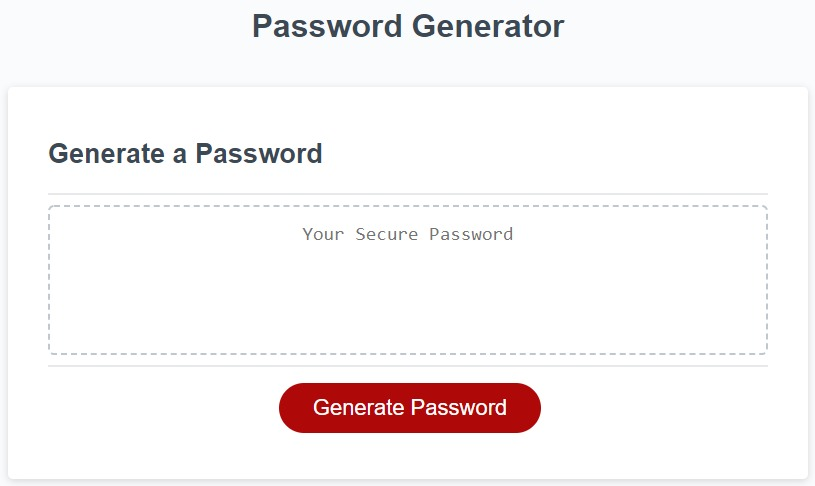

# Password-Generator
this aplication generates passwords with uppercase, lowercase, numbers or special characters and has the option to specify the numbers of characters that you want

# How to use it
the first step is to fill the prompt with the amount of characters you are going to need for your password. i has to be in between 8-128 characters other wise it is not going to work.

after specifying the length of your password you will have to answer wether you want that character or not. there most be at least one selected value.

the password will be generated after completing the steps showing you the result 

link to the deployed project